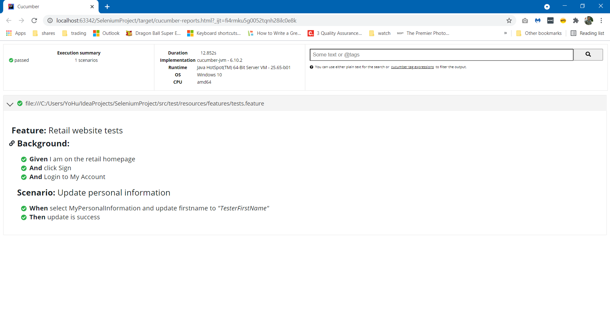
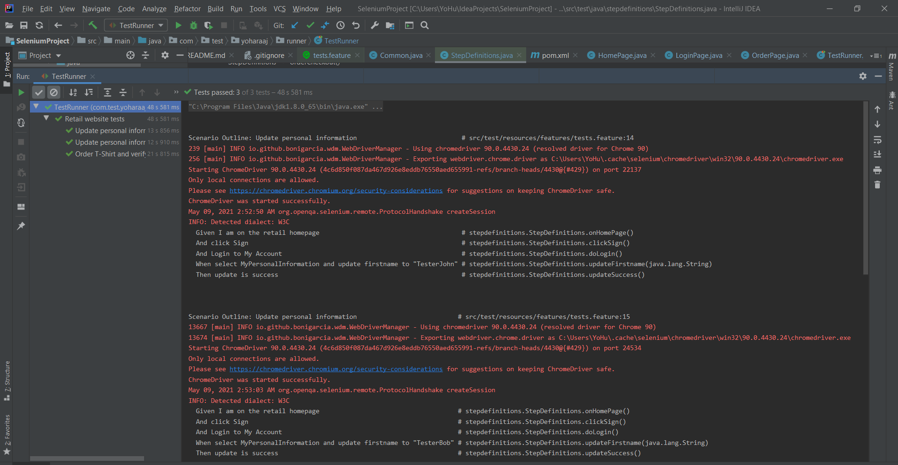

##Test Instructions

Developed this project in BDD Cucumber framework with Selenium Java

Please run the tests using the TestRunner available in src/java/com/test/yoharaaj/runner/TestRunner

This automation pack has 2 following scenarios,
1. Update personal information
2. Order T-Shirt and verify Order History

##Execution Reports Screenshots
Once the tests are completed, report will be generated in the target/cucumber-reports.html
Attached the execution report in the ExecutionReport/ directory.

[cucumber-reports.html](ExecutionReport/cucumber-reports.html)

##File Structure

src/test/resources/features - feature file(s) are available in this package
src/test/java/stepdefinitions - this has the step definitions for all the Gherkin steps written
Under this src/java/com/test/yoharaaj we have 3 following useful packages,
1. helpers package has,
- PropertyReader - For easy maintainability all the Page Objects are placed in a property file and created this PropertyReader.java to fetch the same.
- PageObjectLoader- This methods would use the PropertyReader to fetch the properyy and based on the Property name (.xpath or .id or..) , the locator will be constructed automatically.
These 2 classes would saves time while designing and maintenance effort will be low.
2. pages package - to maintain readability and individual page scripts are avaiable in the respective classes
3. TestRunner - to run the tests

##Further Improvements
- Create method to add more quantity & select different size
- Create reusable method to select item with its title
- Create reusable methods to navigate to different pages. 
    e.g, One method to navigate to "WOMEN" or "DRESSES" or "T-SHIRTS" 
